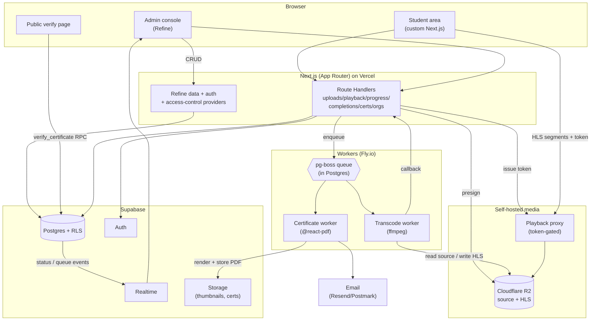
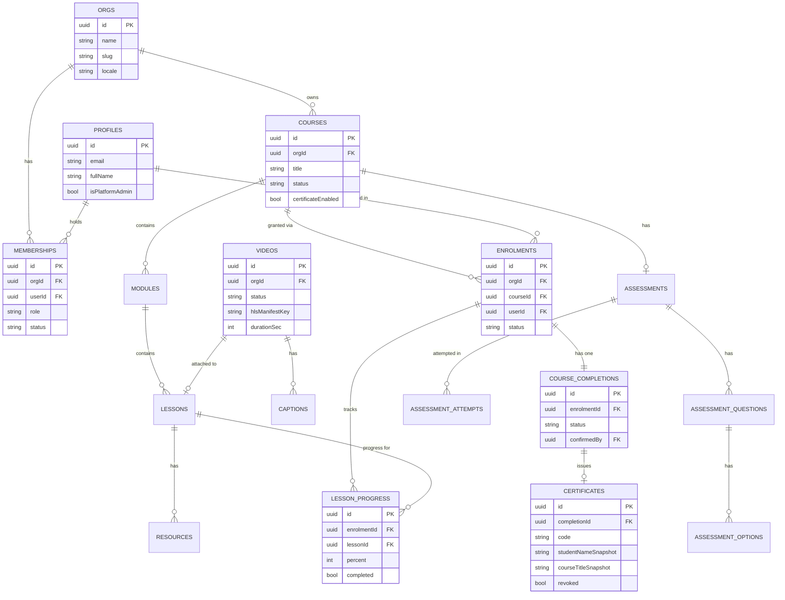
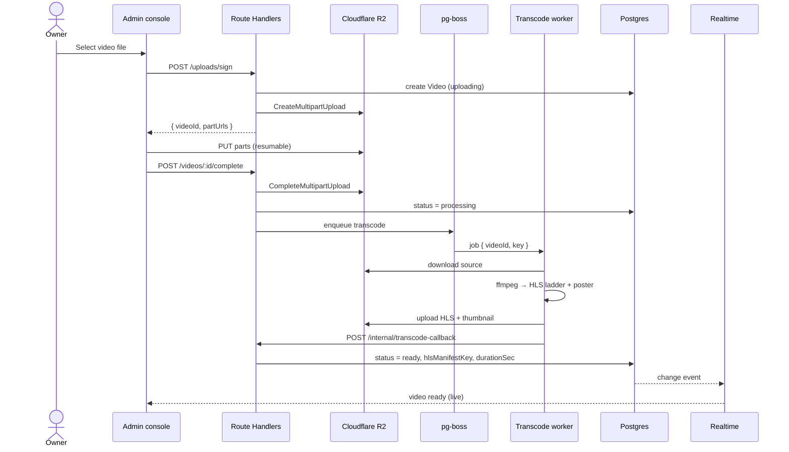
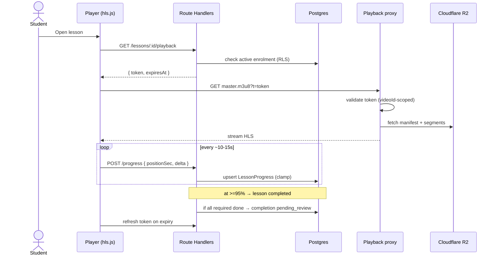
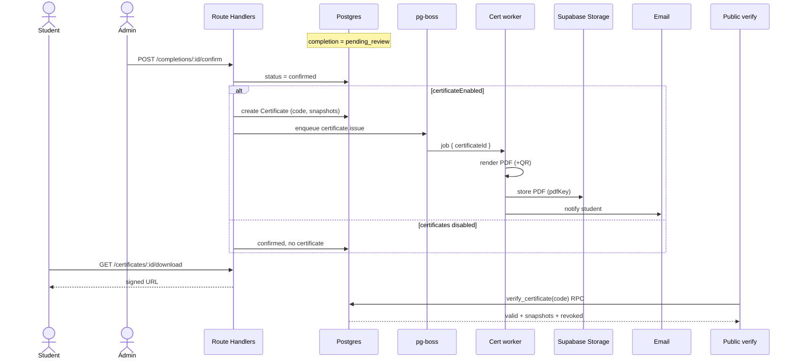
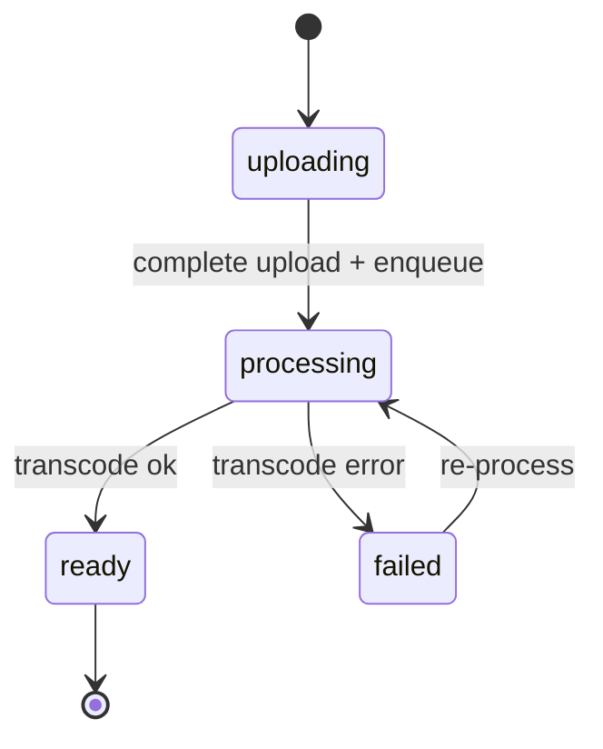
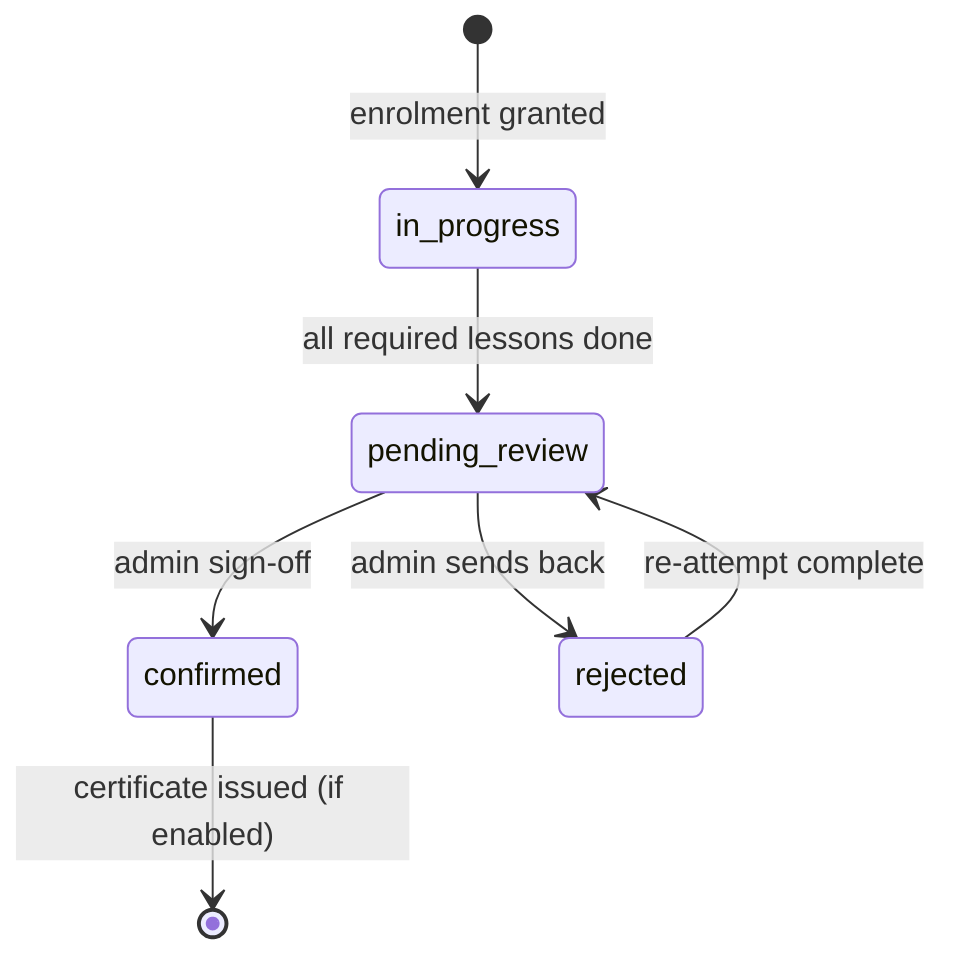

# Course Platform — Architecture Diagrams

> Companion to the PRD and RFC-001/002/003. Mermaid source; renders in any Mermaid-aware viewer.
> **Last updated:** 2026-06-16

---

## 1. System Architecture

---

## 2. Data Model (ERD)

---

## 3. Sequence — Upload & Transcode

---

## 4. Sequence — Secured Playback & Progress

---

## 5. Sequence — Completion → Certificate

---

## 6. State Machines

**Video status**

**Course completion**

